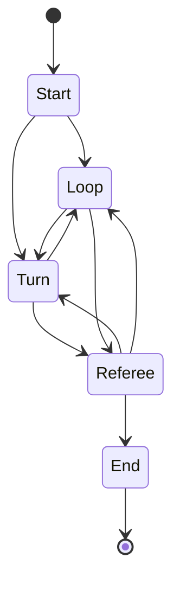

# Máquina de estados de la batalla
Para las batallas, definimos los siguientes estados:

- `Start`: para el inicio del juego y la configuración
- `Loop`: para rotar los turnos entre los jugadores no humanos
- `Turn`: para jugar el turno del humano
- `Referee`: para decidir las partidas y preparar la siguiente ronda
- `End`: para calcular los ganadores y mostrarlos en pantalla

Cada estado tiene de nombre de clase `Battle*`, donde `*` es el nombre de arriba, La organización de los estados es el siguiente:

## Paso a paso de cada estado

### Start
- Establece los datos del jugador
- Establece los datos de los bots
- Configura la UI y los elementos del mundo

Si el primer turno es de nosotros, nos vamos a `BattleTurn`, si no, a `BattleLoop`

### Loop
- Determina quien tiene el turno
- Lanza el dado para el bot
- Deja que el bot actual elija roca y carta
- Juega la carta
- Revisa y delega el siguiente turno

Si el siguiente turno es un bot, vuelve al principio del estado y repite con el siguiente bot.

Si el siguiente turno es del humano, se va a `BattleTurn`

Si no quedan más turnos, nos vamos a `BattleReferee`

### Turn
- Permite clicar el dado
- Al lanzarlo, nos muestra las rocas que son válidas y nos las deja clicar
- Al clicar una roca nos mueve el personaje allí
- Muestra la baraja con las cartas disponibles
- Al clicar una carta, la juega
- Pasa el turno

El criterio de paso de turno es el mismo que en `BattleLoop`

### Referee
- Mira las cartas que cada jugador ha jugado
- Las pone a batallar comparandolas con las reglas definidas
- Aplica los daños y muertes a los jugadores

Comienza la siguiente ronda (llendo a `BattleLoop` o `BattleStart`) si quedan al menos dos jugadores. Si no, se va a `End`

### End
- Mira el ranking de jugadores
- Muestra los resultados en la pantalla de final

Para salir de la escena, se usa el botón de salir que está en el menú.
