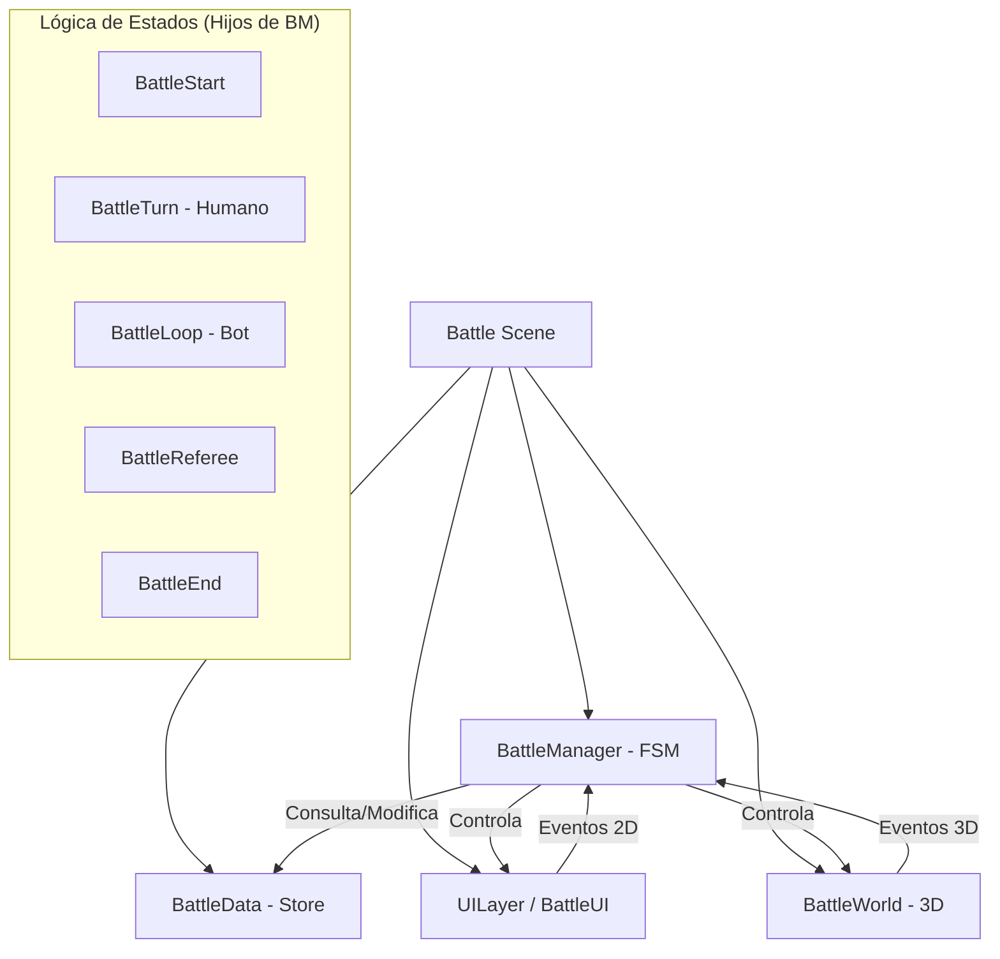

# Arquitectura del Sistema de Batalla - Beast Card Clash

Este documento describe la estructura técnica, el flujo de ejecución y las propuestas de mejora para el sistema de combate de BCC.

## 1. Visión General del Sistema

La escena de batalla (`battle.tscn`) utiliza un patrón **Mediador** combinado con una **Máquina de Estados Finita (FSM)**. El `BattleManager` actúa como el mediador central que conecta la lógica de juego, la interfaz de usuario (UI) y el mundo 3D.

### Diagrama de Componentes



---

## 2. Roles y Responsabilidades

### Core (Lógica Central)
- **BattleManager (StateMachine):** Orquestador de alto nivel. Su única responsabilidad es reaccionar a eventos globales y cambiar estados. No debe contener lógica de "cómo se mueve un jugador".
- **BattleData:** Nodo "Store" que mantiene el estado de la partida (HP, posiciones, ranking). Actúa como la fuente de verdad absoluta.
- **BattleState (Base):** Clase base que inyecta referencias a `manager` y `battle_data` en todos los estados hijos, permitiendo un acceso rápido sin `get_node`.

### World (Mundo 3D)
- **BattleWorld:** Contenedor de la vista 3D. Gestiona la cámara y la iluminación.
- **Dice:** Objeto interactivo con lógica física (Tweens) para determinar valores aleatorios.
- **Rocks:** Sistema de navegación circular. Cada roca conoce su elemento y su índice.
- **Player (3D):** Representación visual que ejecuta Tweens de movimiento al recibir coordenadas.

### UI (Interfaz 2D)
- **BattleUI:** Nodo raíz de la interfaz. Expone métodos para actualizar paneles y la mano de cartas.
- **Hand:** Componente complejo que gestiona la disposición física de las cartas en una curva (Path2D).
- **PlayerPanel:** Componente reactivo que actualiza barras de vida y sprites de cartas.

---

## 3. Flujo de Juego y Sincronía

El sistema depende fuertemente de `await` para sincronizar animaciones visuales con cambios de estado lógico.

### Ciclo de vida de una Ronda:
1. **Inicio de Turno:** `BattleManager` decide el siguiente jugador.
2. **Fase de Selección:**
   - **Humano:** Espera entrada de ratón en Dados -> Rocas -> Cartas.
   - **Bot:** Ejecuta una IA determinista con retardos (`create_timer`).
3. **Fase de Resolución (Referee):** Compara todas las cartas jugadas simultáneamente y aplica daño.
4. **Fase de Limpieza:** Se eliminan jugadores con 0 HP y se resetean las cartas visibles.

---

## 4. Análisis de Errores y "Code Smells"

1.  **Signal Bubbling:** Un clic en el Dado viaja por 4 capas antes de llegar a la lógica.
2.  **Referencia Circular:** `BattleData` -> `BattleManager`.
3.  **Acoplamiento Mundo-UI:** `Player.gd` conoce la existencia de `Hand.gd`.
4.  **Lógica Fragmentada:** Los callbacks del turno humano están en el Manager, no en el estado `BattleTurn`.

---

## 5. Propuesta de Reestructuración

```text
assets/battle/
├── core/                   # Cerebro y Datos
│   ├── states/             # Estados (Start, Turn, Loop, Referee, End)
│   ├── battle_manager.gd   # Mediador
│   └── battle_data.gd      # Store de datos
├── world/                  # 3D
│   ├── components/         # Dice, Rock, Player (Escenas + Scripts)
│   └── battle_world.gd     # Contenedor 3D
├── ui/                     # 2D
│   ├── components/         # Hand, PlayerPanel, EndUI
│   └── battle_ui.gd        # Contenedor UI
└── battle.tscn             # Nodo Raíz
```
