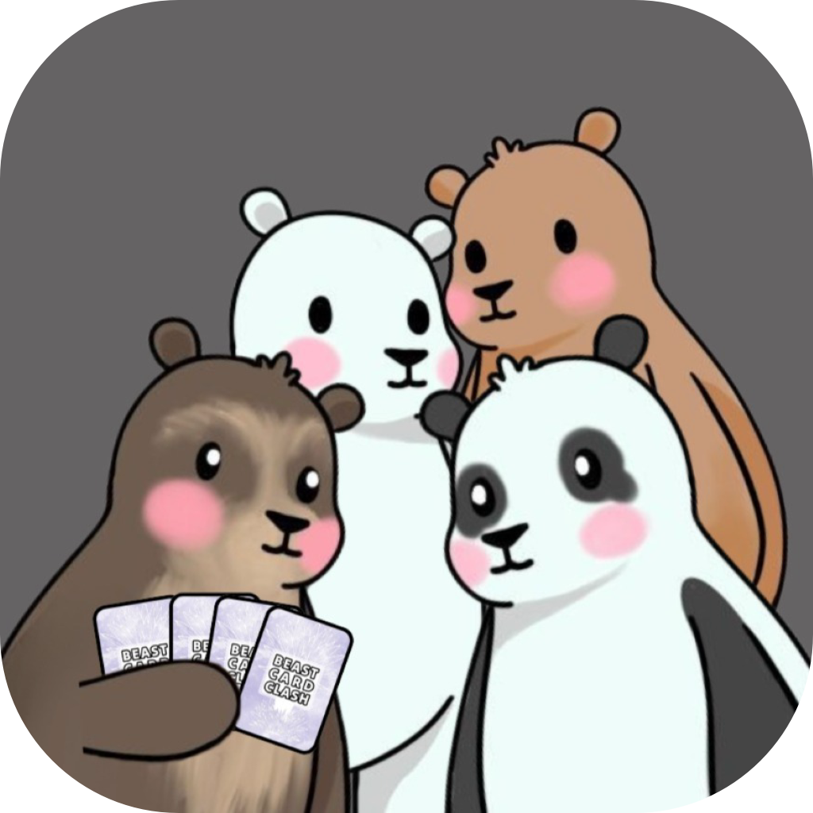

# 🐾🐻‍❄️ Beast Card Clash 🐻🐼

**Beast Card Clash** es juego de cartas por turnos inspirado en Card Jitsu Fuego de Club Penguin. Con un estilo visual animado, los jugadores pueden explorar un mundo abierto que recrea parcialmente a la Universidad Nacional de Colombia y algunas de sus facultades como equipos de deportes en un universo alternativo mientras van progresando en una historia inmersiva.

🌱 Desarrollado por [BCC DevTeam](#integrantes-de-bcc-devteam)

## 🎮 Resumen
Beast Card Clash contiene o plantea contener:

1. Duelos de cartas elementales, divertidos y desafiantes
2. Personajes inspirados en la fauna colombiana
3. Ambientación en la Universidad Nacional con elementos fantásticos
4. Un estilo artístico adorable en 2.5D

## 🗂️ Documentación y contribución
La documentación de este proyecto lo encuentras en la carpeta de [documentación](./.docs) para ajustes rápidos, luego en [esta página](https://andresit1524.github.io/bcc_docs) para lo definitivo.

En la [guía de contribución](./CONTRIBUTING.md) te explicamos como aportar adecuadamente en el desarrollo de este juego.

## 🧠 Créditos y licencia
Beast Card Clash es desarrollado por **BCC DevTeam**, un equipo de desarrollo dentro de GDD, el grupo estudiantil de desarrollo de videojuegos de la Universidad Nacional de Colombia. _El nombre del equipo es temporal_.

> ### Integrantes de BCC DevTeam
>
> **Activos**
> - Hayran Andrés López (el Ralsei) -> Programador
> - Valeria Díaz (Osito) -> Idea original
> - Ricardo Calderón (Richi) -> Administrador y organizador
> - Juan Felipe Naranjo -> Músico
> - Jhonatan (Afrocode) -> Arte de escenarios
> - Lucía (Lu) -> Arte de interfaz (pendiente) y personajes
>
> **Anteriores o retirados**
> - Fabián Montés (Movido45) -> Programación de la demo original en Unity

Este juego actualmente sigue la [**licencia MIT**](./LICENSE.md). La cambiaremos a una propietaria en el futuro, probablemente.
